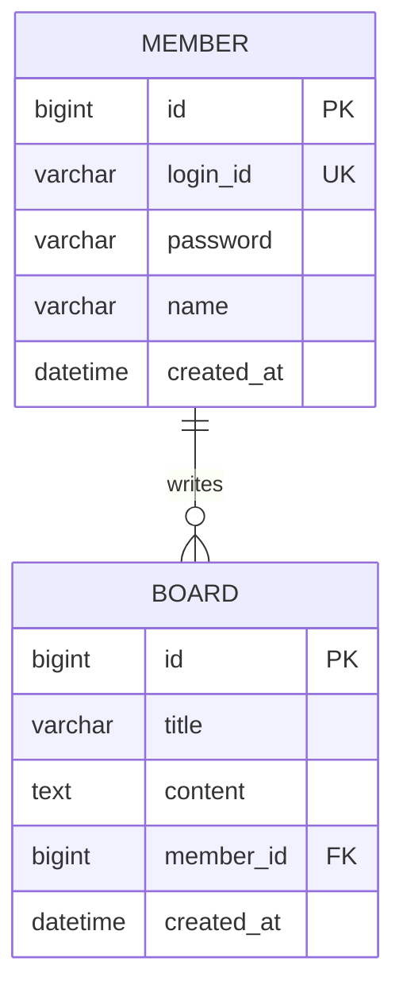

# Week 09 — Java DB 프로그래밍 & MyBatis

> "JDBC 반복 코드 → SQL Mapper / 팀 ERD 첫 산출물"

---

## 이번 주 학습 목표

| # | 목표 | 관련 Lab |
|---|------|---------|
| 1 | JDBC 반복 코드의 실무 통증과 MyBatis가 가져가는 것 이해 | 이론 |
| 2 | MyBatis 4구성요소(yml · Factory · Session · Mapper) 흐름 | 이론 |
| 3 | 커넥션 풀(HikariCP) 동작 원리와 풀 고갈 사고 인지 | 이론 |
| 4 | PreparedStatement vs Statement — `#{}` / `${}` 보안 차이 | 이론 |
| 5 | Spring Boot + MyBatis 학생 CRUD 구현 (5계층) | Lab 01 |
| 6 | Dynamic SQL `<if>` `<choose>` `<set>` `<foreach>` `<trim>` | Lab 03 |
| 7 | Spring Profile로 H2 ↔ MySQL 전환 | Lab 04 |
| 8 | 게시판(Board) 실전 코드로 DTO 패턴·페이징 맛보기 | Lab 05 |
| 9 | 팀 프로젝트 ERD 1차 산출물 작성 (W08 → W09 → W10) | Lab 06 + 과제 |

---

## 4~9주차 연결 지도

```
Week 04  IoC/DI & Bean
         생성자 주입 / @Service / 자동 구성
                      ↓
Week 05  AOP & 트랜잭션 프록시
         @Transactional 동작 원리
                      ↓
Week 06  View & Form 처리
         Thymeleaf, PRG, @ModelAttribute
                      ↓
Week 07  세션 & 웹 보안
         외부 입력은 모두 적이다 (XSS·CSRF·SQL Injection)
                      ↓
Week 08  팀 프로젝트 분석
         FR/NFR · MoSCoW · 요구사항 정의서
                      ↓
Week 09  Java DB & MyBatis  ← 이번 주
         JDBC 통증 → SQL Mapper / Profile / 팀 ERD
                      ↓
Week 10  Spring MVC 패턴 + 트랜잭션 심화
         @ControllerAdvice / 전역 예외 처리
```

---

## 사전 준비 (swframework 프로젝트)

### 1. build.gradle — MyBatis + MySQL 의존성 확인

```gradle
dependencies {
    implementation 'org.springframework.boot:spring-boot-starter-web'
    implementation 'org.springframework.boot:spring-boot-starter-thymeleaf'
    implementation 'org.mybatis.spring.boot:mybatis-spring-boot-starter:3.0.3'
    runtimeOnly    'com.mysql:mysql-connector-j'
    runtimeOnly    'com.h2database:h2'                   // Lab 04부터 필요
    compileOnly    'org.projectlombok:lombok'
    annotationProcessor 'org.projectlombok:lombok'
}
```

### 2. MySQL 데이터베이스 생성

```sql
CREATE DATABASE swframework
  CHARACTER SET utf8mb4 COLLATE utf8mb4_general_ci;
USE swframework;
-- 테이블은 lab01/schema.sql 참고
```

### 3. application.yml (MySQL 모드 — 본인 비번으로 변경 필수)

```yaml
spring:
  datasource:
    url: jdbc:mysql://localhost:3306/swframework?serverTimezone=Asia/Seoul
    username: root
    password: 1234       # ← 본인 MySQL 비밀번호로 변경
    driver-class-name: com.mysql.cj.jdbc.Driver

mybatis:
  mapper-locations: classpath:mapper/*.xml
  type-aliases-package: kr.ac.tukorea.swframework.domain
  configuration:
    map-underscore-to-camel-case: true
    log-impl: org.apache.ibatis.logging.stdout.StdOutImpl
```

> **W08 연결**: `username`/`password`는 **절대 GitHub에 올리지 말 것** — `.gitignore`에 `application-local.yml` 추가하거나 환경변수로 주입.

---

## Lab 흐름

| Lab | 주제 | 핵심 산출물 | 예상 시간 |
|---|---|---|---|
| 01 | 학생 CRUD 5계층 구현 (그린필드) | StudentController/Service/Mapper(I/F+XML)/list·form.html | 30분 |
| 02 | **Spring Data JDBC → MyBatis 마이그레이션 (본인 swframework 적용)** | W06 코드를 Lab 01 결과로 변환 | 20분 |
| 03 | Dynamic SQL 5종 | `<if>` `<choose>` `<set>` `<foreach>` `<trim>` | 25분 |
| 04 | H2 프로필 전환 | application-h2.yml + Console 확인 | 20분 |
| 05 | 게시판 DTO 패턴 (실전) | BoardDTO + PageDTO + 검색 | 25분 (선택) |
| 06 | 팀 ERD 작성 | docs/W09_ERD.md (Mermaid + DDL) | 20분 (과제) |

> **Lab 01 → Lab 02 흐름**: Lab 01에서 **MyBatis 5계층을 처음 짜며 개념을 익히고**, 그 결과물(5개 파일)을 Lab 02에서 **본인 swframework(W06 ListCrudRepository 기반)에 마이그레이션 적용**한다. Lab 01은 학습용 미니 모델, Lab 02는 본인 프로젝트 적용 — **둘 다 거치는 게 정석**.

---

## Lab 01 — 학생 CRUD 5계층 구현

### 목표
> "Controller → Service → Mapper(I/F) → Mapper(XML) → DB"의 5계층을 직접 짠다.

### 단계
1. `lab01/schema.sql`로 student 테이블 생성 + 테스트 데이터 3건 삽입
2. `lab01/Student.java` → `domain/` 패키지에 복사
3. `lab01/StudentMapper.java` → `mapper/` 패키지에 복사
4. `lab01/StudentMapper.xml` → `resources/mapper/`에 복사
5. `lab01/StudentService.java` → `service/` 패키지에 복사
6. `lab01/StudentController.java` → `controller/` 패키지에 복사
7. `lab01/list.html` `lab01/form.html` → `templates/student/`에 복사
8. `./gradlew bootRun` → `http://localhost:8080/students`

### 확인 포인트
- [ ] 목록 페이지에서 3건 표시
- [ ] 등록 → PRG 패턴으로 목록 복귀
- [ ] 수정 → 기존 값 채워진 폼 → 저장 → 변경 확인
- [ ] 삭제 → confirm 후 목록에서 제거
- [ ] SQL 로그 출력 (콘솔에 SELECT/INSERT/UPDATE/DELETE)

### 흔한 오류
| 증상 | 원인 | 해결 |
|---|---|---|
| `Communications link failure` | MySQL 미실행 | `mysql -u root -p`로 실행 확인 |
| `Unknown database 'swframework'` | DB 미생성 | `CREATE DATABASE swframework;` |
| `Invalid bound statement` | namespace 불일치 | XML namespace = Mapper Interface FQCN |
| `Could not resolve type alias` | type-aliases-package 오타 | `kr.ac.tukorea.swframework.domain` 확인 |
| `Access denied` | password 오타 | application.yml의 password 확인 |

> **다음**: Lab 01 동작 확인 후 → **Lab 02**으로 이동. 본인 swframework(W06 코드)에 같은 구조를 마이그레이션해 적용한다.

---

## Lab 02 — Spring Data JDBC → MyBatis 마이그레이션 (Lab 01 결과를 swframework에 적용)

### 목표
> "Lab 01에서 짠 5개 파일을, W06~W07까지 `ListCrudRepository`로 동작하던 본인 swframework에 옮겨 붙인다"

### 흐름
1. Lab 01에서 학생 CRUD가 정상 동작 (5개 파일 완성) — **선행**
2. Lab 02에서 본인 swframework의 W06 코드를 Lab 01 구조로 변환 — **이번 lab**
3. Lab 03~05는 마이그레이션 후 본인 swframework에 누적 적용

### Spring Data JDBC vs MyBatis — 무엇이 다른가

> 둘 다 JDBC 위에 얹는 추상화. 그러나 **"SQL을 누가 쓰는가"**가 정반대.

| 비교 항목 | Spring Data JDBC | MyBatis |
|---|---|---|
| **사고 방식** | 객체부터 시작 — "Student 객체가 곧 student 테이블" | SQL부터 시작 — "이 SQL을 Java에서 호출하고 싶다" |
| **SQL 작성 주체** | 프레임워크가 자동 생성 (`save(s)` → INSERT/UPDATE 자동 분기) | 개발자가 XML에 직접 작성 (`<insert>` / `<update>` 따로 정의) |
| **매핑 방식** | 어노테이션 (`@Table` / `@Id` / `@Column`) — 객체 ↔ 컬럼 1:1 | XML namespace + 메서드 id — `resultType` 또는 `<resultMap>` |
| **복잡한 SQL** | 한계 — 동적 쿼리는 `@Query` 또는 Specification으로 우회 | 강점 — `<if>` / `<choose>` / `<foreach>` 자유 |
| **운영 SQL 튜닝** | Java 재컴파일·재배포 필요 | XML만 수정 → 핫픽스 가능 |
| **학습 곡선** | 낮음 (Repository 인터페이스만) | 중간 (XML 문법 + 동적 SQL 5종) |
| **국내 SI 비중** | 중·소규모, 신규 스타트업, DDD 프로젝트 | 대형 SI / 공공 / 금융 / 전자정부 |

#### 한 줄 요약

| 관점 | Spring Data JDBC | MyBatis |
|---|---|---|
| **장점** | 빠른 개발, 보일러플레이트 제로 | SQL 완전 제어, 운영 친화적 |
| **단점** | 복잡한 SQL은 결국 native query로 우회 | XML 늘어남, 시작 비용 |
| **언제 쓰나** | 도메인 중심 / DDD / 마이크로서비스 | SI 프로젝트 / 복잡한 통계 SQL / 레거시 DB |
| **본 강의 선택** | W06 입문 (Repository 개념 학습) | **W09 본격** — 국내 실무 표준 |

#### 같은 코드, 두 방식 비교

```java
// ── Spring Data JDBC ──────────────────────────────
public interface StudentRepository extends ListCrudRepository<Student, Long> {
    // 끝. findAll/findById/save/deleteById가 자동 제공
}
// 사용: studentRepository.findAll()
```

```java
// ── MyBatis ───────────────────────────────────────
@Mapper
public interface StudentMapper {
    List<Student> findAll();   // SQL은 XML에 별도 정의
}
```
```xml
<!-- StudentMapper.xml -->
<select id="findAll" resultType="Student">
    SELECT id, name, email, major, created_at FROM student ORDER BY id DESC
</select>
```

> **공통점**: 둘 다 `@Service` + `@Transactional` + 생성자 주입은 동일.
> Controller·Service 계층은 **거의 변하지 않는다** — 이게 W04 DI의 보너스.

#### 왜 W09에서 바꾸는가 — 3가지 실무 이유

1. **국내 SI 표준** — 공공기관/금융권/전자정부 표준프레임워크가 모두 MyBatis 채택. 취업 후 첫날 만나는 코드.
2. **동적 SQL 자유도** — 검색 화면 5개 조건 분기, 통계 리포트 같은 SQL은 Spring Data JDBC에서 결국 `@Query` 또는 `JdbcTemplate`로 우회. MyBatis는 처음부터 그게 핵심 기능.
3. **운영 핫픽스** — DBA가 SQL 한 줄 튜닝해서 보내주면, MyBatis는 XML만 교체. Spring Data JDBC는 Java 재배포.

> 결론: **둘 중 무엇이 우월한 게 아니라, 도메인 중심이냐 SQL 중심이냐의 선택.** 본 강의는 둘 다 거치며 트레이드오프를 체감한다.

### 마이그레이션 매핑 (1:1)

| 항목 | Before (W06) | After (W09 / Lab 01 구조) |
|---|---|---|
| Build | `spring-boot-starter-data-jdbc` | `mybatis-spring-boot-starter:3.0.3` |
| 도메인 | `@Table("student")` `@Id` | 순수 POJO + 기본 생성자 |
| 데이터 접근 | `interface ... extends ListCrudRepository` | `@Mapper interface ...` |
| SQL | 자동 생성 | `resources/mapper/*.xml` |
| `save(s)` | id 유무 자동 분기 | Service에서 `insert`/`update` 명시 |
| `@Transactional` | 그대로 | 그대로 (W05 AOP는 영향 없음) |

### 단계 (20분 / 10단계 — Lab 01 결과물 재사용)
1. build.gradle 의존성 교체
2. application.yml에 `mybatis:` 블록 추가
3. Student.java에서 `@Table`/`@Id` 제거 (Lab 01 결과로 교체)
4. `repository/StudentRepository.java` 삭제 → `mapper/StudentMapper.java` 추가 (Lab 01 파일 복사)
5. `resources/mapper/StudentMapper.xml` 추가 (Lab 01 파일 복사)
6. Service 필드를 Repository → Mapper로 교체 + `save()`에서 `insert`/`update` 분기
7. Controller는 **수정 없음** (DI 보너스)
8. Spring Data JDBC 잔재 검색 + 정리
9. `./gradlew clean build` + bootRun
10. H2 프로필도 동작 확인

### 산출물
- `lab02/README.md` — 단계별 상세 가이드 (diff 포함)
- `lab02/migration-checklist.md` — 인쇄용 7-Phase 체크리스트

### 흔한 실수
| 증상 | 원인 |
|---|---|
| `Invalid bound statement` | XML namespace ≠ 인터페이스 FQCN |
| `studentId` 필드만 null | `map-underscore-to-camel-case` 누락 |
| `ListCrudRepository cannot be resolved` | data-jdbc 제거 후 import 잔재 |
| 등록 시 새 row가 안 생김 | Service `save()`에서 분기 없이 `update` 호출 |

> **체크리스트**: `lab02/migration-checklist.md`를 출력해 옆에 두고 한 줄씩 체크하면 실수 0.

> **다음**: 마이그레이션 완료 → **Lab 03 (Dynamic SQL)** 로 이동. 본인 swframework에 검색·다건 조회 기능 누적.

---

## Lab 03 — Dynamic SQL 심화

### 목표
> "런타임에 안전하게 SQL을 조립한다 — 문자열 이어붙이기 X"

### 5가지 태그 결정 트리

```
검색 조건 단 하나?              → <if>
조건 N개 중 하나만?              → <choose> / <when> / <otherwise>
UPDATE에서 부분 컬럼만?          → <set>
WHERE id IN(...) 또는 배치 INSERT? → <foreach>
WHERE/SET가 아닌 특수 접두사?    → <trim>
```

### 단계
- `lab03/StudentMapper_Dynamic.xml` — 5종 태그 응용 SQL을 `lab01/StudentMapper.xml`에 추가
- `lab03/StudentMapper_Dynamic.java` — `findByName` `findBySearchType` `updateSelective` `findByIds` `findByCondition` 메서드
- `lab03/SearchController.java` — `/students/search?type=name&keyword=홍`

### 확인 포인트
- [ ] `?keyword=홍` 검색 결과에 '홍길동'만 나옴
- [ ] `?keyword=` (빈값)이면 전체 목록
- [ ] `updateSelective`로 name만 수정 → email/major는 그대로 유지
- [ ] `findByIds([1,2,3])` → 3건 반환
- [ ] SQL 로그에서 동적 조립된 WHERE/SET 절 확인

> **실무 팁**: 대부분 `<where>` `<set>`만으로 충분. `<trim>`은 SQL 키워드가 WHERE/SET가 아닐 때만 사용.

---

## Lab 04 — H2 프로필 전환

### 목표
> "팀원마다 다른 환경 → MySQL 없이도 즉시 빌드"

### 단계
1. `build.gradle`에 `runtimeOnly 'com.h2database:h2'` 확인
2. `lab04/application-h2.yml` → `resources/`에 복사
3. `resources/sql/schema-h2.sql` `resources/sql/data.sql` 작성
4. 실행: `./gradlew bootRun --args='--spring.profiles.active=h2'`
5. 브라우저: `http://localhost:8080/h2-console`
   - JDBC URL: `jdbc:h2:mem:swframework`
   - User: `sa` / Password: 공백

### 확인 포인트
- [ ] H2 Console에서 `SELECT * FROM student` 동작
- [ ] MySQL 모드(`=mysql`)와 H2 모드(`=h2`) 모두 같은 코드로 동작
- [ ] 종료 후 재실행 시 H2는 데이터 초기화됨 (메모리 모드)

### 자주 나오는 오류
| 증상 | 해결 |
|---|---|
| `Table not found` | `schema-h2.sql` 위치 + `spring.sql.init.mode: always` 확인 |
| Console 접속 불가 | `spring.h2.console.enabled: true` + 재시작 |
| MySQL↔H2 호환 오류 | `DATETIME` → `TIMESTAMP` 통일 / `ENGINE=InnoDB`는 H2에서 무시 |

---

## Lab 05 — 게시판(Board) DTO 패턴 (실전 · 선택)

### 목표
> "Domain ≠ DTO — 실전 게시판 코드는 DTO로 계층 간 전달"

### 학습 흐름
sw-framework-demo의 `BoardDTO`/`BoardMapper.xml` 분석 후 핵심 패턴 3가지 인지:
- 정적 팩토리 메서드 `BoardDTO.of(...)` / `BoardDTO.forUpdate(id, form)`
- `<sql id="searchCondition">` + `<include refid="searchCondition"/>` (재사용)
- `<choose>`로 정렬 분기 + `LIMIT #{size} OFFSET #{offset}` 페이징 (W11 예고)

### 단계
- `lab05/BoardDTO.java` — DTO + 정적 팩토리
- `lab05/BoardMapper.xml` — `<sql>` `<include>` 활용 검색 SQL
- `lab05/board-search.http` — 테스트 시나리오

### 확인 포인트
- [ ] 학생 CRUD와 게시판 CRUD의 **유사 구조** 인식
- [ ] DTO와 Domain의 차이 이해 (계층 간 전달 vs DB 매핑)
- [ ] 같은 검색 조건이 list/count 양쪽에서 재사용됨

> 페이징(LIMIT/OFFSET) 자체는 **Week 11**에서 본격 다룸. 이번 주는 구조만 인지.

---

## Lab 06 — 팀 ERD 작성 (필수 · 과제)

### 목표
> "W08 요구사항 정의서 → W09 ERD → W10 Mapper XML로 이어지는 1차 산출물"

### 단계 (20분)
1. **(3분)** `sw-framework-demo/docs/template/W09_ERD_템플릿.md` 또는 `docs/assignment/W09_ERD_테이블정의서_템플릿.docx`를 팀 저장소 `docs/W09_ERD.md`로 복사
2. **(5분)** W08 요구사항 정의서의 명사 추출 — 회원/게시글/댓글/일정 등
3. **(5분)** 엔티티 후보 검증 — 4가지 기준
   - 독립적으로 존재 가능?
   - 속성을 여러 개 가질 수 있?
   - 다른 엔티티와 관계를 맺을 수 있?
   - **최소 2개 이상 도출**되었?
4. **(4분)** 속성 정의 — 컬럼명·타입·NULL·KEY (PK/FK/UK)
5. **(3분)** 관계 설정 — `||--o{` (1:N) / `}o--o{` (M:N) / `||--||` (1:1)

### 산출물
- `docs/W09_ERD.md` — Mermaid `erDiagram` + 테이블 정의표
- `sql/schema.sql` — DDL 스크립트 (`CREATE TABLE` + FK)
- 과제 제출용 `.docx` (템플릿: `sw-framework-demo/docs/assignment/W09_ERD_테이블정의서_템플릿.docx`)

### Mermaid 예시 (회원-게시글)



### DDL 작성 시 주의

| 체크 항목 | 이유 |
|---|---|
| 참조되는 테이블 먼저 생성 | FK 오류 방지 (member → board 순서) |
| `utf8mb4` + `InnoDB` | 한글·이모지 + 트랜잭션·FK 지원 |
| 컬럼 `COMMENT` 작성 | 유지보수 시 의도 전달 |
| `password` 60자+ | BCrypt 해시 길이 (W07 보안) |

---

## 과제

### 기본 과제 — 학생 CRUD
- [ ] Lab 01 코드 완성 → 4개 기능(목록·등록·수정·삭제) 정상 동작
- [ ] 테스트 데이터 3건 이상 삽입
- [ ] GitHub Push (README + 설정 안내)
- [ ] 실행 화면 캡처 2장 (목록 + 등록)
- [ ] **DB 비밀번호 노출 금지** (커밋 전 `git diff` 확인)

### 심화 과제 — 팀 ERD 작성 (필수)
- [ ] `sw-framework-demo/docs/assignment/W09_ERD_테이블정의서_템플릿.docx` 활용
- [ ] 팀별 작성 → `docs/W09_ERD.md` (Mermaid + 테이블 정의표 + DDL)
- [ ] 엔티티 2개 이상, FK 관계 1개 이상
- [ ] DDL 실행 테스트 완료 (MySQL에서 오류 없이 생성)
- [ ] 1개 테이블에 대해 MyBatis CRUD 구현
- [ ] 팀 저장소에 Push (`docs/W09_ERD.md` + `sql/schema.sql`)

### 제출
- **마감**: 다음 주차 수업 시작 전
- **방법**: e-class 과제 게시판 + GitHub Push
- **금지**: 타인 코드 복붙 / AI 코드 전체 사용 / 비밀번호 노출

### 채점 루브릭
| 항목 | 배점 | 기준 |
|---|---|---|
| CRUD 정상 동작 | 30 | 4개 기능 모두 동작 / 일부 실패 시 비례 감점 |
| 5계층 분리 | 20 | Controller→Service→Mapper / 미분리 시 감점 |
| Mapper XML | 20 | SQL 정확성 + `#{}` 사용 / `${}` 사용 시 감점 |
| Git 관리 | 15 | 의미 있는 커밋 / **비밀번호 노출 시 0점** |
| 가독성·문서 | 15 | 한국어 주석 + README + ERD.md |

---

## 참고 자료

- [MyBatis 한국어 문서](https://mybatis.org/mybatis-3/ko/index.html)
- [MyBatis-Spring Boot Starter](https://github.com/mybatis/spring-boot-starter)
- [HikariCP](https://github.com/brettwooldridge/HikariCP)
- [Mermaid Live Editor](https://mermaid.live)
- 전자정부 표준프레임워크 데이터처리 교재
- 코딩 자율학습 스프링 부트 (홍팍 저, 길벗)
