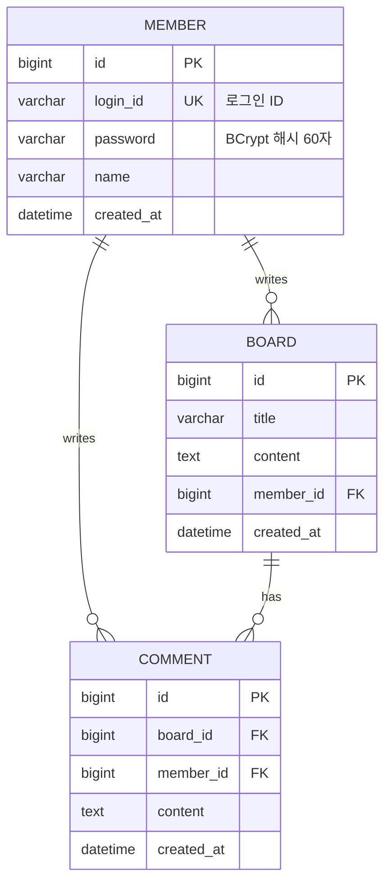

# Lab 06 — 팀 프로젝트 ERD 작성 가이드

> W08 요구사항 정의서 → **W09 ERD** → W10 Mapper XML로 이어지는 1차 산출물

## 시작 전 체크

- [ ] W08 요구사항 정의서(`docs/W08_요구사항_정의서.md`) 확인
- [ ] FR 5개 이상, MoSCoW의 Must 4~6개 확정
- [ ] 팀 저장소의 `docs/` 폴더 존재

## 작성 위치

```
sw-framework-demo/docs/
├── template/
│   └── W09_ERD_템플릿.md           ← Markdown 템플릿
├── assignment/
│   └── W09_ERD_테이블정의서_템플릿.docx   ← 과제 제출용 docx
└── W09_ERD.md                      ← 팀별 작성 결과
```

## 5단계 작성 흐름 (예상 20분)

### 1단계 — 템플릿 복사 (3분)
```bash
cp sw-framework-demo/docs/template/W09_ERD_템플릿.md docs/W09_ERD.md
# 또는 .docx 다운로드 후 팀 저장소 docs/W09_ERD.docx
```

### 2단계 — 명사 추출 (5분)
W08 요구사항에서 **명사**만 골라 후보 정리:

> 예: "회원이 게시글을 작성하고, 다른 회원이 댓글을 단다"
> → 명사: **회원**, **게시글**, **댓글**

### 3단계 — 엔티티 후보 검증 (5분)

| 검증 기준 | YES면 엔티티 |
|---|---|
| 독립적으로 존재 가능? | "회원"은 게시글이 없어도 존재 → ✓ |
| 속성을 여러 개 가질 수 있? | 회원 = id + 이메일 + 이름 → ✓ |
| 다른 엔티티와 관계? | 회원 ↔ 게시글 → ✓ |
| 최소 2개 이상 도출? | 필수 |

### 4단계 — 속성 정의 (4분)
각 엔티티별 컬럼 작성. 최소 항목:
- **PK** (`id` BIGINT AUTO_INCREMENT)
- **NOT NULL** 비즈니스 필수 컬럼
- **UK** (Unique Key — 로그인 ID, 이메일 등)
- **FK** (Foreign Key — 다른 테이블 참조)
- **created_at** (DATETIME DEFAULT CURRENT_TIMESTAMP)

### 5단계 — 관계 설정 (3분)

| Mermaid 표기 | 의미 | 예시 |
|---|---|---|
| `||--||` | 1:1 | 회원 ↔ 프로필 |
| `||--o{` | 1:N | 회원(1) ↔ 게시글(N) |
| `}o--o{` | N:M | 학생 ↔ 강좌 (중간 테이블 필요) |

## 산출물 예시



## DDL 작성 규칙

```sql
-- 1. 참조되는 테이블 먼저 (member → board → comment 순서)
CREATE TABLE member (
    id          BIGINT       NOT NULL AUTO_INCREMENT,
    login_id    VARCHAR(50)  NOT NULL UNIQUE,         -- UK
    password    VARCHAR(100) NOT NULL,                 -- BCrypt 해시 (W07)
    name        VARCHAR(50)  NOT NULL,
    created_at  DATETIME     NOT NULL DEFAULT CURRENT_TIMESTAMP,
    PRIMARY KEY (id)
) ENGINE=InnoDB DEFAULT CHARSET=utf8mb4 COMMENT='회원';

CREATE TABLE board (
    id          BIGINT       NOT NULL AUTO_INCREMENT,
    title       VARCHAR(200) NOT NULL,
    content     TEXT         NOT NULL,
    member_id   BIGINT       NOT NULL,
    created_at  DATETIME     NOT NULL DEFAULT CURRENT_TIMESTAMP,
    PRIMARY KEY (id),
    FOREIGN KEY (member_id) REFERENCES member(id)
) ENGINE=InnoDB DEFAULT CHARSET=utf8mb4 COMMENT='게시글';

-- 2. 인덱스는 자주 검색하는 컬럼에 추가
CREATE INDEX idx_board_member_id ON board(member_id);
CREATE INDEX idx_board_created   ON board(created_at DESC);
```

## 자주 하는 실수

| 실수 | 결과 |
|---|---|
| `member` 생성 전에 `board` 생성 | FK 오류 — 참조 무결성 위반 |
| `created_at`을 NOT NULL 빼먹음 | NULL 데이터로 정렬 불가 |
| `password` VARCHAR(20) | BCrypt 해시(60자) 저장 불가 |
| `utf8` (utf8mb3) 사용 | 이모지·일부 한자 깨짐 |
| FK 없이 ID만 저장 | 참조 무결성 X — 고아 레코드 생성 |
| 테이블 5개 초과 | 7주 안에 완성 어려움 — Won't로 분리 |

## 제출 체크리스트

### `docs/W09_ERD.md` 또는 `.docx`
- [ ] 프로젝트명·팀명·DB 버전·테이블 수 명시
- [ ] Mermaid `erDiagram` 코드 + GitHub 렌더링 확인
- [ ] 관계 설명 표 (1:1 / 1:N / N:M 구분)
- [ ] 테이블별 컬럼 정의 표 (NULL / KEY / 설명)
- [ ] DDL 스크립트 (MySQL 8.0+)
- [ ] 초기 데이터(선택)

### `sql/schema.sql`
- [ ] DDL 실행 테스트 완료 (오류 없이 모든 테이블 생성)
- [ ] FK 관계 모두 정상

### Git
- [ ] `docs/W09_ERD.md` Push
- [ ] `sql/schema.sql` Push
- [ ] **DB 비밀번호 없음** 확인 (`git diff`)

## 다음 주(W10) 활용

- `docs/W09_ERD.md`의 **테이블 → MyBatis Mapper XML** 변환
- 1개 핵심 엔티티에 대해 CRUD + 검색 구현
- `@ControllerAdvice`로 전역 예외 처리 추가

> **잊지 말 것**: 오늘 ERD 한 줄을 잘못 그으면 W14 발표에서 100배 비싸진다 (1:10:100 법칙).
